### Como o **[Ruby não e uma linguagem compilável](https://www.ruby-lang.org/pt/about/)**, ou seja ela é uma linguagem interpretada, precisamos de um Prompt de Command para interpreta-la via linha de comando!
### No nosso caso como estamos no Windows, vamos usar um programinha bem top e turbinado que se chama Console Emulator.

# Instalando Console Emulator:
  ## 1 - Faça download do pacote FULL no site [http://cmder.net/](http://cmder.net/)
  

  ## 2 - Deppois precisamos Desconpactar o arquivo de download <b>(Sugiro fazer isto dentro da pasta C:/)</b>
  
  

  ## 3 - Então e só entrar na pasta que foi criada e executar o seguinte arquivo:
  '''
  Cmder.exe
  '''
  

  ## 4 - Será aberto o seguinte terminal:
  

  ### Se o terminal que foi aberto for semelhando ao acima, estamos prontos para começar a instalação do ruby.

# Istalando Ruby no Windows
  ##  1 - Fazer download da versão estável do ruby, ela sempre estará em **Negrito** como na imagem!
  Link: [http://rubyinstaller.org/downloads/](http://rubyinstaller.org/downloads/)
  

  ## 2 - Depois que o Download foi finalizado e so executar o arquivo e ele abrirá a seguinte janela:
  ### **Selecionar a opção "I accept the License" e clicar em "Next >"**
  

  ### **Preencher todos os flag's como na imagem, clicar em "Install"**
  

  ### **Preencher todos os flag's como na imagem, clicar em "Next >"**
  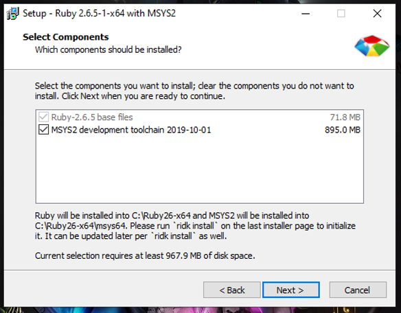

  ### **Ruby sendo instalado…**
  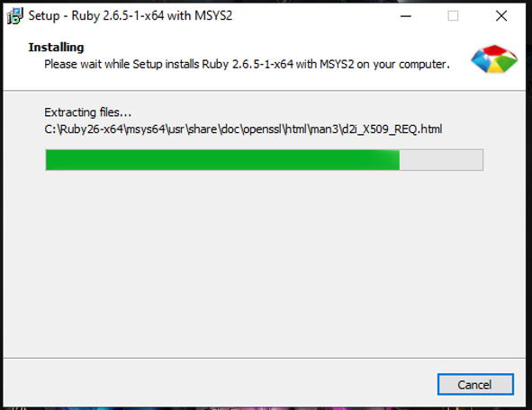

  ### **Clicar em “Finish”, em seguida abrirá um terminal para instalação dos certificados e dependencias!**
  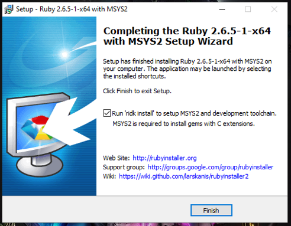

  ### **Será aberto um terminal como o da imagem!!**
  ### **Ele te dará 3 opções de instalação, apenas pressione Enter e aguarde!!**
  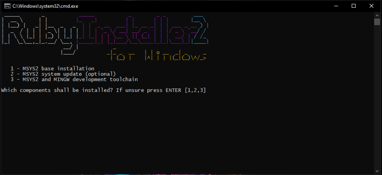

  ### **Iniciando a instalação das dependências do Ruby.**
  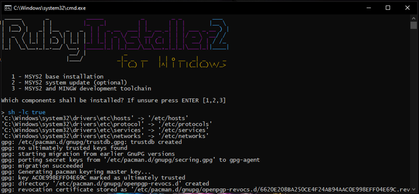

  ### **Se nenhum bloqueio tiver acontecido, a tela final será assim, e só pressionar enter que tudo foi instalado lindamente.**
  
  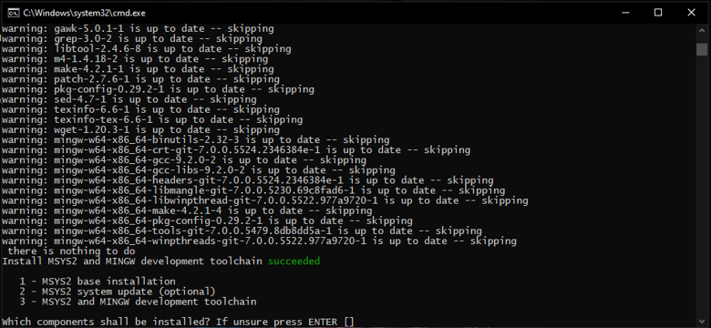

  ### **Para verificar se o Ruby foi instalado e só abrir o CMD e digitar o comando:**
  '''
  Ruby -v
  '''
  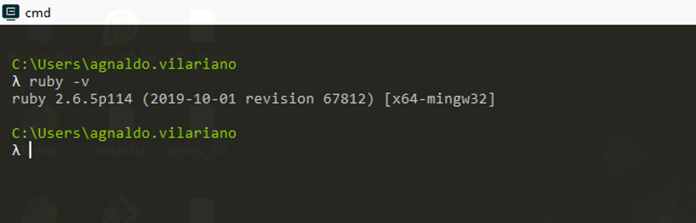
  ### **Se sua resposta foi igual a está, parabéns deu tudo certo!**

# **Instalando o [VScode](https://code.visualstudio.com)**
  ## 1 - Faça download do vscode no site: [https://code.visualstudio.com](https://code.visualstudio.com)
  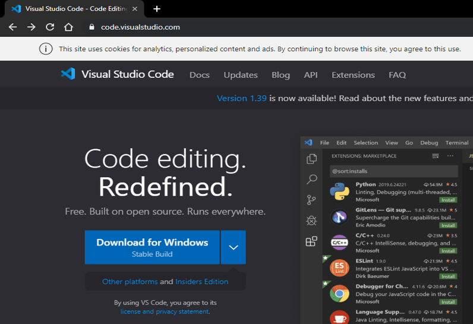

  ### **Depois que o download for finalizado, execute o arquivo**
  ### **A segunte janela será aberta, Aceitar os termos e clicar em "Next >"**
  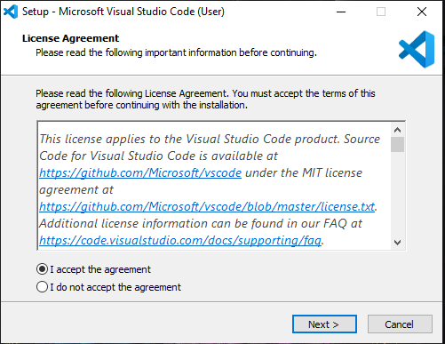

  ### **Usar a pasta padrão do sistema e clicar em "Next >"**
  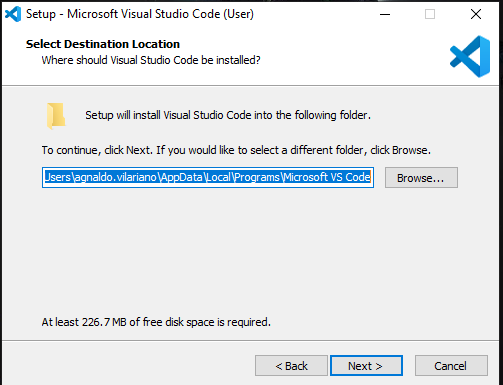

  ### **Não precisa criar uma pasta inicial, clicar em "Next >"**
  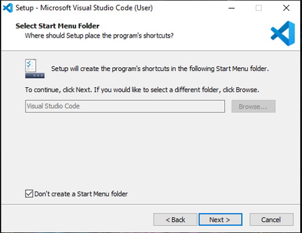

  ### **Selecionar os seguintes flags, clicar em "Next >"**
  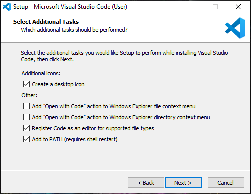
  
  ### **Clicar em "Install"...**
  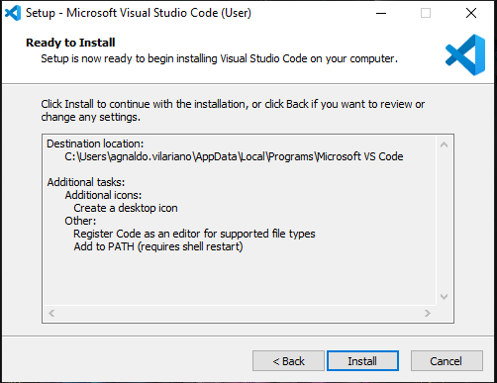
  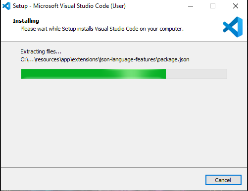

  ### **Clicar em "Finish"**
  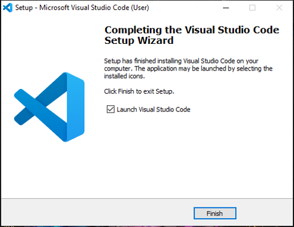

# **Ponto, Ruby instalado e pronto para uso!!!**